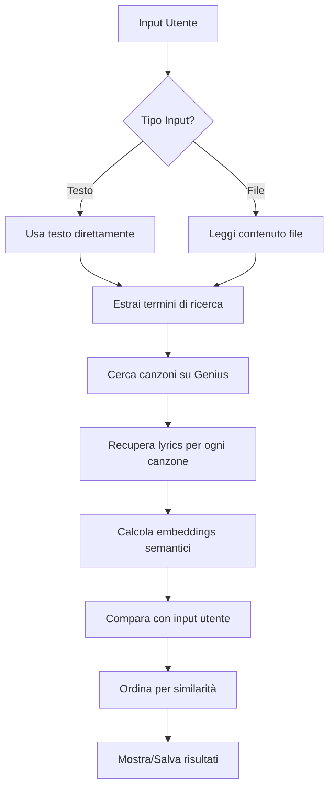

# Documentazione Tecnica - Cerca Dai Testi

## Architettura del Sistema

Il progetto segue un'architettura modulare con separazione delle responsabilità:

```
┌─────────────────────────────────────────────────────────────┐
│                        main.py                               │
│                    (CLI + Orchestration)                     │
└─────────────────────────────────────────────────────────────┘
                              │
              ┌───────────────┴───────────────┐
              ▼                               ▼
┌─────────────────────────┐     ┌─────────────────────────────┐
│    lyrics_fetcher.py    │     │    semantic_matcher.py      │
│    (Genius API Client)  │     │    (NLP Processing)         │
└─────────────────────────┘     └─────────────────────────────┘
              │                               │
              └───────────────┬───────────────┘
                              ▼
┌─────────────────────────────────────────────────────────────┐
│                        utils.py                              │
│              (Cache, RateLimiter, Logging)                   │
└─────────────────────────────────────────────────────────────┘
                              │
                              ▼
┌─────────────────────────────────────────────────────────────┐
│                        config.py                             │
│                   (Configuration Layer)                      │
└─────────────────────────────────────────────────────────────┘
```

## Flusso di Esecuzione



## Moduli

### config.py

Gestisce tutte le configurazioni dell'applicazione attraverso la classe `Config`:

- Carica variabili d'ambiente da `.env`
- Definisce costanti operative (limiti, timeout, etc.)
- Valida la configurazione all'avvio

**Configurazioni principali:**

| Variabile | Default | Descrizione |
|-----------|---------|-------------|
| `GENIUS_API_TOKEN` | - | Token API (obbligatorio) |
| `CACHE_EXPIRY_HOURS` | 24 | Durata cache in ore |
| `RATE_LIMIT_CALLS` | 10 | Chiamate API per periodo |
| `EMBEDDING_MODEL` | paraphrase-multilingual-MiniLM-L12-v2 | Modello NLP |

### lyrics_fetcher.py

Interfaccia con l'API Genius per la ricerca e il recupero dei testi.

**Classi:**

- `Song`: Dataclass che rappresenta una canzone
- `LyricsFetcher`: Client per Genius API

**Metodi principali:**

```python
# Cerca canzoni per keyword
songs = fetcher.search("love", limit=10)

# Recupera lyrics completi
song = fetcher.get_lyrics(song)

# Combinazione search + lyrics
songs = fetcher.get_songs_with_lyrics("happiness", limit=5)
```

**Note implementative:**
- I lyrics non sono disponibili via API, vengono estratti via scraping HTML
- La cache memorizza sia i risultati delle ricerche che i lyrics
- Il rate limiter previene blocchi da parte di Genius

### semantic_matcher.py

Implementa il matching semantico usando sentence-transformers.

**Classi:**

- `MatchResult`: Risultato con score e estratto rilevante
- `SemanticMatcher`: Engine di matching

**Algoritmo di similarità:**

1. Il testo della canzone viene diviso in chunk (~500 caratteri)
2. Si calcola l'embedding per ogni chunk
3. Si calcola la cosine similarity con l'embedding della query
4. Si seleziona il chunk con score più alto

```python
similarity = dot(query_emb, chunk_emb) / (norm(query_emb) * norm(chunk_emb))
```

**Modello utilizzato:**

Il modello di default `paraphrase-multilingual-MiniLM-L12-v2`:
- Supporta 50+ lingue
- Dimensione embedding: 384
- Ottimizzato per similarità semantica

### utils.py

Utilities condivise tra i moduli.

**Classi:**

- `Cache`: Sistema di caching su disco con scadenza
- `RateLimiter`: Sliding window rate limiter

**Funzioni:**

- `setup_logging()`: Configura il logger
- `retry_on_error()`: Decorator per retry automatico
- `clean_lyrics()`: Rimuove annotazioni dai testi
- `truncate_text()`: Tronca testo con ellipsis

## Caching

Il sistema utilizza due cache separate:

1. **lyrics_cache.json**: Risultati ricerche e testi
2. **embeddings_cache.json**: Vettori embedding calcolati

Struttura cache:
```json
{
  "md5_hash_della_chiave": {
    "data": "contenuto cached",
    "timestamp": "2024-01-15T10:30:00"
  }
}
```

La cache scade dopo `CACHE_EXPIRY_HOURS` (default 24h).

## Rate Limiting

Implementazione sliding window:

```
Periodo: 60 secondi
Max chiamate: 10

Timeline:
[0s]  call1 ──────────────────────────────────────── [60s] scade
   [5s]  call2 ─────────────────────────────────────────── [65s] scade
      [10s] call3 ──────────────────────────────────────────── [70s] scade
         ...
```

Se si raggiunge il limite, la funzione `acquire()` blocca fino a quando una chiamata scade.

## Estensibilità

### Aggiungere un nuovo provider lyrics

1. Crea una nuova classe che implementa gli stessi metodi di `LyricsFetcher`
2. Modifica `main.py` per usare il nuovo provider

```python
class MusixmatchFetcher:
    def search(self, query: str, limit: int) -> List[Song]:
        ...

    def get_lyrics(self, song: Song) -> Song:
        ...
```

### Cambiare modello NLP

Modifica `EMBEDDING_MODEL` in `.env`:

```
# Modelli alternativi:
EMBEDDING_MODEL=all-MiniLM-L6-v2          # Solo inglese, più veloce
EMBEDDING_MODEL=all-mpnet-base-v2          # Più accurato, più lento
EMBEDDING_MODEL=distiluse-base-multilingual-cased-v2  # Multilingua alternativo
```

## API Reference

### LyricsFetcher

```python
class LyricsFetcher:
    def __init__(self, api_token: Optional[str] = None)
    def search(self, query: str, limit: int = 5) -> List[Song]
    def search_by_terms(self, terms: List[str], limit_per_term: int = 5) -> List[Song]
    def get_lyrics(self, song: Song) -> Song
    def get_songs_with_lyrics(self, query: str, limit: int = 5) -> List[Song]
    def clear_cache(self) -> None
```

### SemanticMatcher

```python
class SemanticMatcher:
    def __init__(self, model_name: Optional[str] = None)
    def compute_similarity(self, query: str, text: str) -> Tuple[float, str]
    def find_similar_songs(self, query: str, songs: List[Song], limit: int = 5, min_score: float = 0.3) -> List[MatchResult]
    def extract_key_phrases(self, text: str, top_k: int = 5) -> List[str]
    def clear_cache(self) -> None
```

### Cache

```python
class Cache:
    def __init__(self, cache_name: str = "cache.json", expiry_hours: Optional[int] = None)
    def get(self, key: str) -> Optional[Any]
    def set(self, key: str, value: Any) -> None
    def clear(self) -> None
    def cleanup_expired(self) -> int
```

### RateLimiter

```python
class RateLimiter:
    def __init__(self, max_calls: Optional[int] = None, period: Optional[int] = None)
    def acquire(self) -> None  # Blocca se necessario
    def remaining(self) -> int
```

## Performance

**Tempi tipici:**

| Operazione | Tempo |
|------------|-------|
| Prima esecuzione (download modello) | 30-60s |
| Ricerca 5 canzoni + lyrics | 10-20s |
| Ricerca con cache | 1-3s |
| Calcolo embedding singolo | ~50ms |

**Ottimizzazioni:**

- Cache su disco per persistenza tra sessioni
- Lazy loading del modello NLP
- Ricerche parallele per più termini (possibile estensione)
